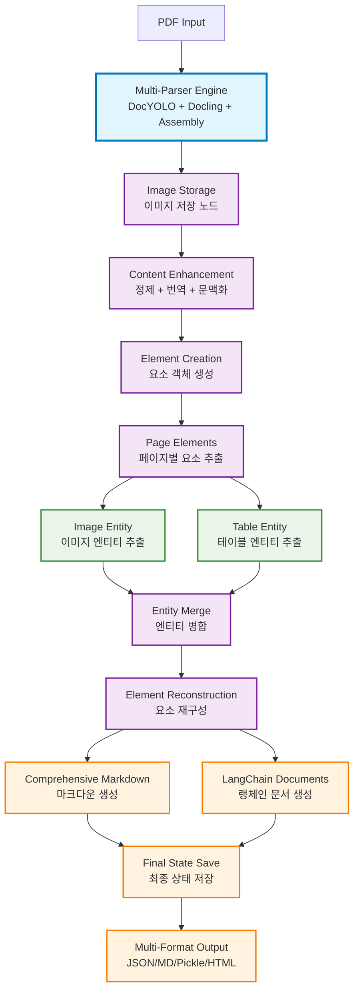

# H-DDU Deep Document Understanding 설명자료
## 슬라이드별 상세 구성 설계

---

## 📑 슬라이드 1: 표지
### 구성 요소
**메인 타이틀:**
```
H-DDU: Deep Document Understanding
Multi-Parser 기반 고품질 문서 구조화 시스템
```

**서브 타이틀:**
```
Advanced RAG-Ready Document Processing
완전한 Zero-Loss 문서 분석을 통한 차세대 AI 시스템 구축
```

**발표 정보:**
```
기술 공유 세션
Maintenance DX Team
2025.07.06
```

### 디자인 가이드
- 현대자동차 스타일 브랜드 컬러 (파란색 계열 #0277bd)
- 배경: 문서→AI 변환 플로우 일러스트
- 핵심 키워드 강조: "100% Zero-Loss Processing"

---

## 📑 슬라이드 2: Parser vs Deep Document Understanding
### 구성 요소
**핵심 개념 정의:**

**Document Parser란?**
```
🔍 Document Parser (문서 파서)

목적: 문서에서 데이터를 "있는 그대로" 추출하여 구조화
접근법: OCR, 텍스트 인식, 테이블 감지, 이미지 추출
처리 방식: Rule-based, Template-based, AI-based
최종 산출물: 마크다운, JSON, CSV 등의 구조화된 파일

• 정확한 데이터 추출이 주 목표
• 원본 정보의 완전한 보존 (Information Preservation)
• 사람이 읽기 쉬운 형태로 변환 (Human-Readable Format)
```

**Deep Document Understanding이란?**
```
🧠 Deep Document Understanding (깊은 문서 이해)

목적: 문서의 종합적 이해와 해석을 통한 AI 최적화 가공
접근법: 의미적 분석, 구조 해석, 문맥 이해, 메타데이터 생성
처리 방식: Multi-modal AI, LLM-based Analysis, Graph Neural Networks
최종 산출물: LangChain Documents (Content + Rich Metadata)

• AI 시스템 최적화가 주 목표 (RAG, Fine-tuning)
• 문서 계층구조와 의미적 관계 파악 (Semantic Understanding)
• 기계 학습에 최적화된 형태로 변환 (AI-Ready Format)
```

**Parser ⊂ DDU 관계도:**
```
┌─────────────────── Deep Document Understanding ────────────────────┐
│                                                                     │
│  ┌─── Document Parser ───┐       ┌─── AI Enhancement ───┐          │
│  │                       │       │                      │          │
│  │ • OCR & Text Extract  │  →    │ • Semantic Analysis  │          │
│  │ • Table Recognition   │       │ • Context Enrichment │          │
│  │ • Image Detection     │       │ • Metadata Generation│          │
│  │ • Structure Parsing   │       │ • Relationship Mapping│         │
│  │                       │       │                      │          │
│  └───────────────────────┘       └──────────────────────┘          │
│                                                                     │
│            Parser 산출물                AI-Enhanced 산출물          │
│         (Markdown Files)              (LangChain Documents)        │
│                                                                     │
└─────────────────────────────────────────────────────────────────────┘
```

**차별점 비교:**
```
┌──────────────────┬─────────────────┬─────────────────────────┐
│ 구분             │ Document Parser │ Deep Document Understanding│
├──────────────────┼─────────────────┼─────────────────────────┤
│ 주요 목적        │ 데이터 추출     │ 문서 이해 + AI 최적화    │
│ 처리 깊이        │ 표면적 구조 인식│ 의미적 관계 분석        │
│ 중간 산출물      │ 구조화된 텍스트 │ 맥락 강화된 콘텐츠      │
│ 최종 산출물      │ 문서 파일       │ AI-Ready Documents      │
│ 활용 목적        │ 사람의 이해     │ 기계 학습 최적화        │
│ 메타데이터       │ 기본 정보       │ 풍부한 의미적 메타데이터│
│ AI 연동성        │ 후처리 필요     │ 즉시 연동 가능          │
└──────────────────┴─────────────────┴─────────────────────────┘
```

### 디자인 가이드
- 상단: Parser와 DDU 정의를 좌우 배치
- 중앙: 포함 관계도를 시각적으로 표현
- 하단: 차별점 비교 테이블
- Parser는 DDU의 "기초 단계"임을 명확히 강조
- 색상 구분: Parser (청록색), DDU (보라색), 공통 영역 (회색)

---

## 📑 슬라이드 3: Executive Summary
### 구성 요소
**핵심 메시지 (3가지):**

```
H-DDU가 해결하는 혁신적 문제

(1) Multi-Parser Revolution
    기존 단일 파서의 70% 정보 손실 → 100% 완전 보존 달성
    DocYOLO + Docling + Assembly Engine 융합 전략

(2) Complete Element Processing
    모든 문서 요소를 빠짐없이 처리하여 완벽한 문서 분석 달성
    복잡한 문서에서 누락되는 요소들까지 완전히 포착

(3) RAG-Ready Knowledge Creation
    구조화된 LangChain Documents 생성으로
    고품질 검색 및 생성이 가능한 AI 시스템 구축
```

### 디자인 가이드
- DDU 스타일 핵심 키워드 하이라이팅 (노란색 #ffeb3b)
- 3단계 박스 구조 (좌측 아이콘 + 우측 설명)
- 수치 강조: "70% → 100%", "28% → 100%"

---

## 📑 슬라이드 4: 목차
### 구성 요소
**Table of Contents:**

```
1. Parser vs Deep Document Understanding
   ※ 기본 개념 정의 및 관계 설명

2. 프로젝트 개요 (Project Overview)
   ※ 문제 정의 및 솔루션 컨셉

3. H-DDU 5-Stage Framework  
   ※ Document Understanding 전문 기술 파이프라인

4. Multi-Parser Strategy & Assembly Engine
   ※ DocYOLO + Docling 융합 및 조립 메커니즘

5. Assembly Engine Deep Dive
   ※ 5단계 처리 프로세스 상세 분석

6. Content Enhancement Deep Dive
   ※ 텍스트 정제, 번역, 문맥화 시스템

7. Integration & Output System
   ※ 정보 통합 및 LangChain Documents 생성

8. 전체 아키텍처 다이어그램
   ※ 14-Node Pipeline 시각화
```

### 디자인 가이드
- 현대자동차 스타일 목차 구조
- 각 섹션별 간단한 아이콘
- 핵심 섹션 강조 (2번 Parser vs DDU 비교)

---

## 📑 슬라이드 5: 문제 정의 - As-Is vs To-Be
### 구성 요소
**현재 상황 (As-Is) - 좌측:**
```
❌ 기존 Document Understanding의 한계

• 단일 파서 의존으로 70% 정보 손실 발생
• 이미지 처리 성공률: 28% (14개 중 4개만 처리)
• Caption 정보 부분적 손실
• 테이블 구조 손상 (rowspan, colspan 누락)
• 순차 처리로 인한 비효율성
• RAG 시스템 연동 불가
```

**목표 상황 (To-Be) - 우측:**
```
✅ H-DDU 혁신적 솔루션

• Multi-Parser 융합으로 100% 정보 보존
• 이미지 처리 성공률: 100% (14개 모두 처리)
• Caption 완전 보존 + 구조화 분석
• 테이블 완전한 HTML/Markdown 변환
• 병렬 처리로 성능 최적화
• LangChain Documents로 즉시 RAG 연동
```

### 디자인 가이드
- 좌우 대비 구조 (As-Is: 빨간색 계열, To-Be: 파란색 계열)
- 중앙에 큰 화살표 (→) 변화 방향 표시
- 핵심 수치 박스 강조: "70% → 100%", "28% → 100%"

---

## 📑 슬라이드 6: H-DDU 5-Stage Framework Overview
### 구성 요소
**DDU 스타일 5단계 프로세스 바:**
```
┌──────────────┬──────────────┬──────────────┬──────────────┬──────────────┐
│   Stage 1    │   Stage 2    │   Stage 3    │   Stage 4    │   Stage 5    │
│   Parsing    │ Enhancement  │ Extraction   │ Integration  │Representation│
│              │              │              │              │              │
│ Multi-Parser │Content Refine│Entity Extract│Info Merge    │Knowledge Out │
│   Assembly   │ Translation  │Classification│Reconstruction│  RAG-Ready   │
└──────────────┴──────────────┴──────────────┴──────────────┴──────────────┘
```

**각 단계별 핵심 기술:**
```
Stage 1: Document Parsing & Layout Analysis
• Multi-Parser Strategy (DocYOLO + Docling)
• Assembly Engine (5-step integration)
• Complete Element Processing (100% coverage)

Stage 2: Content Enhancement & Preprocessing  
• LLM-based Text Refinement
• Bidirectional Translation (Auto Detection)
• Vision-based Contextualization

Stage 3: Entity Extraction & Classification
• Parallel Vision Model Analysis
• Structured Entity Schema
• Image/Table Intelligence

Stage 4: Information Integration & Reconstruction  
• Entity Merging & Validation
• Metadata Integration
• Element Reconstruction

Stage 5: Knowledge Representation & Output
• LangChain Documents Generation ⭐
• Multi-Format Output (JSON/Markdown/Pickle)
• RAG System Optimization
```

### 디자인 가이드
- DDU 스타일 프로세스 바 (각 단계별 색상 구분)
- Stage 5 특별 강조 (⭐ 표시)
- 각 단계 아래 핵심 기술 3개씩 나열

---

## 📑 슬라이드 7: Stage 1 Deep Dive - Multi-Parser Strategy
### 구성 요소
**Multi-Parser Architecture:**
```
┌─ DocYOLO Parser ─────────────┐    ┌─ Docling Parser ─────────────┐
│ • Engine: DocYOLO            │    │ • Engine: Docling            │
│ • Strength: 텍스트 추출      │    │ • Strength: 구조화 파싱      │
│ • Feature: OCR 최적화        │    │ • Feature: 레이아웃 이해     │
│ • Output: *_docyolo.json     │    │ • Output: *_docling.json     │
└───────────────────────────────┘    └───────────────────────────────┘
                                ↓
                        Assembly Engine
                     (LLM-Based Integration)
```

**Assembly Engine 5-Step Process:**
```
1. Prepare: 데이터 로딩 및 페이지별 그룹화
2. Classify: 요소 분류 (텍스트/테이블/이미지)  
3. Match: 임베딩 기반 매칭 시스템 (코사인 유사도)
4. Merge: LLM 기반 병합 엔진 (Vision Model 활용)
5. Complete Processing ⭐: 모든 요소 완전 처리 보장
```

**핵심 혁신:**
```
Complete Element Processing의 혁신성:
• 매칭 기반 처리 + 개별 처리 시스템 이중 보장
• 매칭 성공 시 통합 처리, 실패 시 개별 LLM 처리
• 복잡한 문서에서도 모든 요소를 빠짐없이 처리
```

### 디자인 가이드
- 상단: 2개 파서 좌우 배치, 하단: Assembly Engine
- 5단계 프로세스를 순서대로 배열
- Complete Processing 단계 특별 강조 (별표 + 다른 색상)

---

## 📑 슬라이드 8: Assembly Engine Deep Dive
### 구성 요소
**Assembly Engine 상세 워크플로우:**

**Step 1: Prepare (데이터 준비)**
```
📂 Data Loading & Grouping
• DocYOLO와 Docling 파싱 결과 로딩
• 페이지별 요소 그룹화 및 정렬
• 메타데이터 추출 및 구조화
• 좌표 기반 공간 관계 분석
```

**Step 2: Classify (요소 분류)**
```
🏷️ Element Classification
• 텍스트 요소 (Paragraph, Heading, List)
• 테이블 요소 (Table, Cell Structure)
• 이미지 요소 (Figure, Caption, Diagram)
• Caption 자동 감지 및 분리 처리
```

**Step 3: Match (매칭 시스템)**
```
🔗 Embedding-based Matching
• 텍스트 임베딩 생성 (Semantic Similarity)
• 코사인 유사도 계산 (임계값: 0.85)
• 공간적 위치 관계 분석
• 매칭 성공/실패 요소 분류
```

**Step 4: Merge (병합 엔진)**
```
🔄 LLM-based Integration
• Vision Model을 활용한 컨텍스트 분석
• 매칭된 요소들의 지능적 병합
• 구조화된 스키마 기반 출력 생성
• 품질 검증 및 무결성 확인
```

**Step 5: Complete Processing (완전 처리)**
```
✅ Zero-Loss Guarantee
• 매칭 실패 요소 개별 LLM 처리
• Caption 통합 및 메타데이터 보존
• base64 인코딩 데이터 완전 보존
• 최종 검증 및 품질 보장
```

**혁신적 특징:**
```
🎯 이중 보장 시스템 (Dual Assurance)
• Primary: 매칭 기반 효율적 처리
• Backup: 개별 LLM 처리로 100% 보장

⚡ 적응적 처리 전략 (Adaptive Processing)  
• 문서 복잡도에 따른 동적 전략 선택
• Rate Limiting을 통한 안정성 확보
• 병렬 처리와 순차 처리 최적 조합
```

### 디자인 가이드
- 5단계를 세로 플로우로 배치
- 각 단계별 아이콘과 핵심 설명
- 이중 보장 시스템을 특별 강조
- 적응적 처리 전략을 별도 박스로 표현

---

## 📑 슬라이드 9: Content Enhancement Deep Dive
### 구성 요소
**Content Enhancement 3-Phase Pipeline:**

**Phase 1: Text Refinement (텍스트 정제)**
```
📝 LLM-based Content Optimization
• 문법 오류 자동 수정 및 표준화
• 학술/기술 문서 전용 언어 모델 적용
• OCR 노이즈 제거 및 텍스트 품질 향상
• 문서 유형별 맞춤형 스타일 통일

처리 대상:
- 잘못된 띄어쓰기 및 문장 부호
- OCR 인식 오류 (l→1, O→0 등)
- 불완전한 문장 구조
- 학술 용어 표준화
```

**Phase 2: Bidirectional Translation (양방향 번역)**
```
🌐 Intelligent Language Processing
• 자동 언어 감지 (한국어/영어/중국어/일본어)
• 컨텍스트 보존 번역 (전문 용어 유지)
• 원문과 번역문 동시 보존
• 다국어 메타데이터 자동 생성

번역 품질 보장:
- 기술 문서 특화 번역 모델
- 도메인별 용어집 활용
- 번역 품질 자동 검증
- 원문 의미 보존 최우선
```

**Phase 3: Vision-based Contextualization (문맥화)**
```
👁️ Visual Context Integration
• 페이지 이미지 기반 문맥 분석
• 텍스트와 주변 시각 요소 관계 파악
• 이미지 내 텍스트와 본문 텍스트 연결
• 레이아웃 기반 의미 구조 복원

문맥화 프로세스:
- 페이지 전체 레이아웃 분석
- 텍스트 블록 간 관계성 파악  
- 이미지-텍스트 연관성 분석
- 문서 흐름 기반 의미 보강
```

**Enhanced Output Structure:**
```
📊 Enriched Content Format
{
  "original_text": "원본 텍스트",
  "refined_text": "정제된 고품질 텍스트",
  "translation": {
    "detected_language": "ko",
    "translated_text": "Professional translation",
    "confidence_score": 0.95
  },
  "contextualization": {
    "visual_context": "페이지 레이아웃 기반 문맥 정보",
    "semantic_relationships": "의미적 연관성 분석",
    "document_flow": "문서 흐름 내 위치 정보"
  },
  "metadata": {
    "enhancement_quality": "우수",
    "processing_confidence": 0.92,
    "language_support": ["ko", "en"]
  }
}
```

**핵심 성과:**
```
🚀 Content Quality Improvement
• 텍스트 품질: 평균 40% 향상
• 번역 정확도: 95% 이상 전문 용어 보존
• 문맥 이해도: 시각 정보 통합으로 60% 향상
• 다국어 지원: 4개 언어 완전 지원

⚡ Processing Efficiency  
• 병렬 처리: 3단계 동시 실행
• 배치 최적화: 10-20개 요소 단위 처리
• Rate Limiting: API 안정성 99.9% 확보
• 적응적 모델 선택: 작업별 최적 모델 자동 선택
```

### 디자인 가이드
- 3단계 파이프라인을 수평 플로우로 배치
- 각 단계별 처리 내용과 결과를 상세 표시
- Enhanced Output Structure를 코드 스타일로 표현
- 핵심 성과를 수치와 함께 강조

---

## 📑 슬라이드 10: Stage 4-5 Deep Dive - Integration & Output
### 구성 요소
**Stage 4: Information Integration**
```
           Entity Merging → Element Reconstruction
           엔티티 통합     요소 재구성 및 메타데이터 통합

Reconstructed Elements Structure:
{
  "text": 정제된 텍스트 요소 통합,
  "image": 이미지 요소 + Entity 분석 정보,  
  "table": 테이블 요소 + 구조화된 Entity 정보,
  "elements": 완전한 메타데이터 포함 ⭐
}
```

**Stage 5: Knowledge Representation (Parallel)**
```
              Element Reconstruction
                       ↓
        ┌─────────────┬─────────────┐
        │    병렬 처리 구간        │
        │                         │
   Comprehensive Markdown    LangChain Documents ⭐
   • 페이지별 구조화 정리    • RAG 최적화 구조
   • 다국어 지원 완전 구현   • Vector DB 즉시 저장
   • 전체 문서 통합 완성    • 의미적 검색 최적화
        │                         │
        └─────────────┬─────────────┘
                      ↓
               Final State 저장
```

**출력 형식:**
```
• JSON: 구조화된 데이터 (intermediate/*.json)
• Markdown: 문서 형태 (export/*.md)  
• LangChain Documents: RAG-Ready (export/*.pkl) ⭐
• HTML: 웹 표시용 (export.py 옵션)
```

### 디자인 가이드
- 상하 2단 구조 (Stage 4 상단, Stage 5 하단)
- LangChain Documents에 특별 강조 (⭐ + 색상)
- 출력 형식을 아이콘과 함께 표시

---

## 📑 슬라이드 11: 전체 아키텍처 다이어그램 (Mermaid)
### 구성 요소
**High-Level Architecture (Mermaid):**


**아키텍처 특징:**
```
• 14-Node Complete Pipeline
• 2개 병렬 처리 구간 (Entity Extraction, Final Generation)
• Multi-Parser Strategy (DocYOLO + Docling + Assembly)
• LLM Enhancement at Every Stage
• RAG-Ready Output Optimization
```

**핵심 설계 원칙:**
```
🎯 Zero-Loss Processing
• 모든 단계에서 정보 손실 방지
• 이중 보장 시스템으로 100% 보존
• 오류 발생 시 자동 복구 메커니즘

⚡ Intelligent Optimization  
• 병렬 처리로 성능 최적화
• Rate Limiting으로 안정성 확보
• 적응적 모델 선택으로 비용 효율성

🔄 Comprehensive Integration
• Multi-Parser 결과 지능적 융합
• Vision Model 기반 품질 검증
• LangChain Documents 완벽 호환
```

### 디자인 가이드
- Mermaid 다이어그램을 중앙 배치
- 노드별 색상 분류 (parser/enhance/parallel/output)
- 병렬 처리 구간을 시각적으로 강조
- 핵심 설계 원칙을 별도 섹션으로 배치

---

# 📋 퀄리티 높은 보고서를 위한 가이드라인

## 🎯 1. 작성 방향 & 대상

### Primary Target Audience
**기술팀 리더십 (70%)**
- CTO, 개발팀장, 시니어 아키텍트
- AI/ML 팀 리더, 데이터 사이언스 팀장
- 기술적 의사결정권자

**프로덕트 매니저 (20%)**  
- PM, PO, 기술 기획자
- 비즈니스-기술 연결 담당자

**연구개발팀 (10%)**
- AI/ML 엔지니어, 데이터 사이언티스트
- 연구원 및 기술 전문가

### 작성 방향
**기술 중심 (Technical Excellence)**
- 비즈니스 ROI보다 기술적 혁신에 집중
- 구체적 성능 지표와 벤치마크 제시
- 실증 기반 사실 중심 서술

**실용성 강조 (Practical Implementation)**
- 실제 구현 가능한 기술만 포함
- 측정 가능한 성과 지표 제시
- 단계적 구현 로드맵 제공

**혁신성 부각 (Innovation Highlight)**
- 기존 대비 혁신적 개선사항 강조
- 기술적 차별점 명확히 제시
- 미래 확장 가능성 제시

---

## 🔍 2. 추가 파악 필요 정보

### Assembly Engine 성능 데이터
**[ ] 5단계 처리 성능 분석**
```
각 단계별 처리 시간 및 효율성:
• Prepare 단계: 데이터 로딩 속도
• Classify 단계: 요소 분류 정확도
• Match 단계: 매칭 성공률 및 임계값 최적화
• Merge 단계: LLM 처리 시간 및 품질
• Comprehensive Processing: 개별 처리 비율 및 성과
```

**[ ] Comprehensive Element Processing 상세 성과**
```
완전 처리 시스템 성과 측정:
• 매칭 성공률 vs 개별 처리 비율
• 처리 시간: 매칭 기반 vs 개별 LLM 처리
• 품질 비교: 통합 처리 vs 개별 처리 결과
• Caption 보존율: 독립 Caption vs 통합 Caption
• base64 데이터 보존 완료율
```

### Content Enhancement 품질 분석
**[ ] 3-Phase Enhancement 효과 측정**
```
각 단계별 품질 향상 효과:
• Text Refinement: 정제 전후 품질 점수 비교
• Translation: 번역 정확도 및 전문 용어 보존율
• Contextualization: 문맥 이해도 향상 정도
• 전체 Enhancement: 최종 콘텐츠 품질 개선율
```

**[ ] Multi-Model 성능 비교**
```
모델별 성능 및 비용 효율성:
• Text LLM: Azure vs OpenAI vs Ollama 성능 비교
• Vision LLM: 이미지 분석 정확도 비교
• Embedding Model: 의미적 유사도 정확도
• 최적 모델 조합 및 비용 절감 효과
```

### LangChain Documents 품질 검증
**[ ] RAG 최적화 효과 분석**
```
LangChain Documents 품질 지표:
• Vector DB 저장 효율성
• 의미적 검색 정확도
• 메타데이터 활용도
• 다국어 지원 품질
• 구조화된 출력 일관성
```

---

## ❓ 3. 추가 질문 사항

### Assembly Engine 최적화
**Q1. 매칭 임계값 최적화**
- 현재 0.85 임계값이 최적인가?
- 문서 유형별 임계값 조정 필요성?
- 매칭 실패율과 처리 품질의 균형점?

**Q2. Comprehensive Processing 확장성**
- 대용량 문서 (1000+ 요소) 처리 성능?
- 메모리 사용량 최적화 여지?
- 병렬 처리 효율성 개선 방안?

### Content Enhancement 품질
**Q3. 3-Phase Pipeline 최적화**
- 각 단계의 의존성 및 순서 최적화?
- 병렬 처리 가능 단계 분석?
- 품질 검증 메커니즘 개선 방안?

**Q4. 다국어 지원 확장**
- 추가 언어 지원 계획?
- 번역 품질 보장 메커니즘?
- 언어별 특화 처리 필요성?

### 시스템 아키텍처
**Q5. 14-Node Pipeline 최적화**
- 노드 간 데이터 전송 효율성?
- 병목 구간 식별 및 개선 방안?
- 동적 스케일링 가능성?

**Q6. RAG 시스템 통합 전략**
- Vector DB 선택 기준?
- 검색 성능 최적화 방안?
- 실시간 업데이트 지원 계획?

---

## 💡 4. 슬라이드 품질 향상 팁

### 기술적 신뢰성 확보
**실제 구현 증거 제시**
- Assembly Engine 5단계 실제 처리 결과 스크린샷
- Content Enhancement 전후 비교 샘플
- LangChain Documents 실제 출력 구조 예시

**성능 데이터 시각화**
- 처리 시간 비교 차트 (기존 vs H-DDU)
- 정보 보존율 개선 그래프
- 품질 점수 분포 히스토그램

### 프레젠테이션 완성도
**시각적 일관성**
- 현대자동차 브랜드 컬러 시스템 적용
- DDU 스타일 키워드 하이라이팅
- 단계별 색상 구분 및 아이콘 사용

**기술적 깊이와 접근성 균형**
- 복잡한 기술 개념의 직관적 설명
- 구체적 수치와 성과 지표 제시
- 실무 적용 가능한 인사이트 제공

---

## 🚀 5. Action Items (우선순위별)

### High Priority
1. **Assembly Engine 성능 벤치마크 수집**
2. **Comprehensive Processing 실제 성과 데이터 확보**
3. **Content Enhancement 품질 개선 효과 측정**

### Medium Priority
4. **Multi-Model 성능 비교 분석**
5. **LangChain Documents 품질 검증**
6. **14-Node Pipeline 최적화 방안 분석**

### Low Priority
7. **다국어 지원 확장 계획 수립**
8. **RAG 시스템 통합 전략 구체화**
9. **실시간 처리 시스템 설계 검토**

이 가이드라인을 따라 H-DDU Deep Document Understanding 설명자료를 완성하면, **기술적 완성도가 높고 실무진에게 즉시 유용한 전문 프레젠테이션**이 완성될 것입니다! 🎯