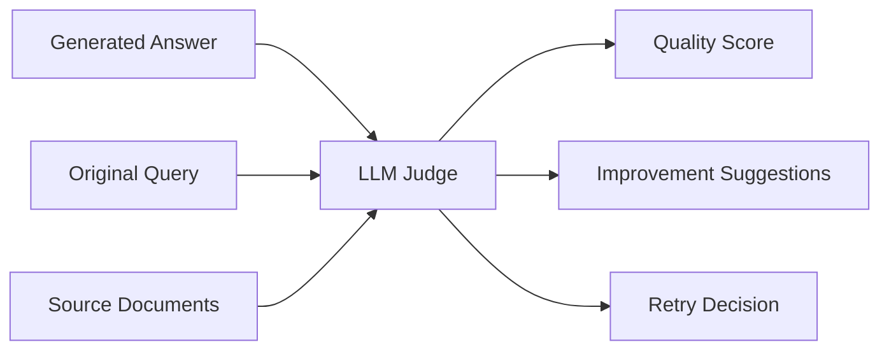
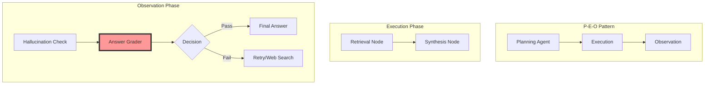
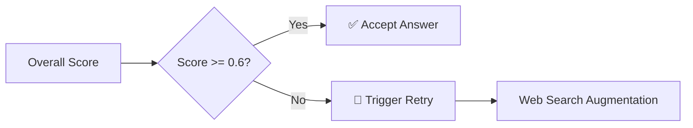
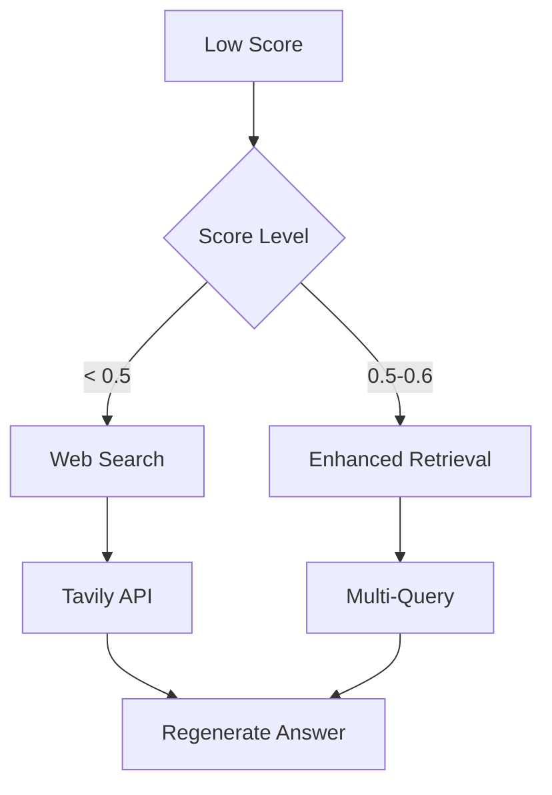

# LLM as Judge in Production: Vehicle Manual RAG System의 Answer Grader 구현 사례

---

## Slide 1: Title
# LLM as Judge in Production
### Vehicle Manual RAG System의 Answer Grader 구현 사례
#### Production-Ready 품질 평가 시스템 구축하기

**발표자**: [Your Name]  
**날짜**: 2025년 1월  
**소속**: [Your Organization]

---

## Slide 2: 문제 제시
# RAG 시스템의 딜레마

### 🤔 핵심 과제
- **답변 품질을 어떻게 측정할 것인가?**
- **언제 재시도가 필요한가?**
- **사용자에게 신뢰할 수 있는 답변인가?**

### 📊 기존 방식의 한계
| 방법 | 문제점 |
|------|--------|
| 규칙 기반 평가 | 유연성 부족, 도메인 특화 어려움 |
| 인간 평가 | 비용 높음, 확장성 제한 |
| 단순 유사도 | 의미적 품질 평가 불가 |

**💡 Solution: LLM as Judge**

---

## Slide 3: LLM as Judge 패러다임
# LLM as Judge란?

### 핵심 개념


### 주요 장점
- ✅ **확장성**: 자동화된 대규모 평가
- ✅ **일관성**: 동일한 기준으로 평가
- ✅ **해석가능성**: 평가 이유 설명 제공
- ✅ **도메인 특화**: 프롬프트로 쉽게 조정

---

## Slide 4: 시스템 아키텍처
# CRAG 워크플로우 내 Answer Grader



### Answer Grader의 역할
- **최종 품질 게이트키퍼**
- **재시도 결정권자**
- **개선 방향 제시자**

---

## Slide 5: 4차원 평가 프레임워크
# 다차원 품질 평가 체계

## 평가 차원과 가중치

```python
weights = {
    "completeness": 0.35,  # 완전성
    "relevance": 0.30,     # 관련성
    "clarity": 0.20,       # 명확성
    "usefulness": 0.15     # 유용성
}
```

### 각 차원별 평가 기준

| 차원 | 1.0 (최고) | 0.7-0.9 (양호) | 0.4-0.6 (보통) | 0.0-0.3 (미흡) |
|------|------------|----------------|----------------|----------------|
| **Completeness** | 모든 측면 완벽 대응 | 대부분 커버 | 일부 누락 | 주요 내용 누락 |
| **Relevance** | 정확히 질문 대응 | 대체로 관련 | 부분적 관련 | 주제 벗어남 |
| **Clarity** | 완벽한 구조 | 명확함 | 개선 필요 | 혼란스러움 |
| **Usefulness** | 즉시 실행 가능 | 유용한 정보 | 일부 도움 | 실용성 없음 |

---

## Slide 6: 구조화된 출력 설계
# Pydantic 모델 활용

```python
class AnswerGradeResult(BaseModel):
    """답변 평가 결과"""
    # 점수 필드
    overall_score: float = Field(description="Overall quality score (0.0-1.0)")
    completeness_score: float
    relevance_score: float
    clarity_score: float
    usefulness_score: float
    
    # 상세 피드백
    missing_aspects: List[str] = Field(
        description="List of query aspects not addressed"
    )
    improvement_suggestions: List[str] = Field(
        description="Specific suggestions to improve"
    )
    strengths: List[str] = Field(
        description="Strong points of the answer"
    )
    reasoning: str = Field(
        description="Detailed reasoning for assessment"
    )
```

### 장점
- ✅ **타입 안정성**: 런타임 검증
- ✅ **자동 문서화**: Field descriptions
- ✅ **LLM 호환성**: `with_structured_output()` 지원

---

## Slide 7: 평가 프롬프트 엔지니어링
# 도메인 특화 프롬프트

### 차량 매뉴얼 특화 평가 기준
```python
"""
For vehicle manual queries, pay special attention to:
- Safety warnings and cautions ⚠️
- Specific procedures and steps 📋
- Technical specifications 🔧
- Maintenance schedules 📅
- Part numbers or references 🔢
- Proper citations [1], [2] 📚
- Completeness of References section 📖
"""
```

### 프롬프트 구조
1. **System Message**: 평가자 역할과 기준 정의
2. **Evaluation Criteria**: 4차원 상세 기준
3. **Domain Specifics**: 차량 매뉴얼 특화 요구사항
4. **Output Format**: 구조화된 결과 요청

---

## Slide 8: 점수 계산과 의사결정
# 임계값 기반 품질 관리

```python
def _calculate_overall_score(self, grade_result: AnswerGradeResult) -> float:
    """가중치를 적용한 전체 점수 계산"""
    overall = (
        grade_result.completeness_score * 0.35 +
        grade_result.relevance_score * 0.30 +
        grade_result.clarity_score * 0.20 +
        grade_result.usefulness_score * 0.15
    )
    return min(overall, 1.0)

# 임계값 기반 재시도 결정
threshold = 0.6  # 환경변수로 조정 가능
needs_retry = overall_score < threshold
```

### 의사결정 흐름


---

## Slide 9: 실행 흐름 상세
# 단계별 처리 과정

```python
async def __call__(self, state: MVPWorkflowState) -> Dict[str, Any]:
    # 1️⃣ 답변 가져오기
    answer = state.get("intermediate_answer") or state.get("final_answer")
    
    # 2️⃣ 검증: 문서 존재 확인
    if not documents:
        raise ValueError("Cannot grade without source documents")
    
    # 3️⃣ 문서 요약 생성
    summary = self._summarize_documents(documents)
    
    # 4️⃣ LLM 평가 실행
    grade_result = await structured_llm.ainvoke(prompt)
    
    # 5️⃣ 점수 계산 및 로깅
    overall_score = self._calculate_overall_score(grade_result)
    logger.info(f"Scores: {overall_score:.3f}")
    
    # 6️⃣ 품질 체크 결과 반환
    return {
        "answer_grade": quality_check,
        "should_retry": needs_retry,
        "metadata": enriched_metadata
    }
```

---

## Slide 10: 메타데이터와 추적
# 평가 결과 활용

### 저장되는 메타데이터
```json
{
  "answer_grade": {
    "overall_score": 0.785,
    "completeness": 0.8,
    "relevance": 0.9,
    "clarity": 0.7,
    "usefulness": 0.6,
    "missing_aspects": [
      "Specific torque specifications",
      "Safety precautions for battery"
    ],
    "strengths": [
      "Clear step-by-step instructions",
      "Proper references to manual sections"
    ],
    "low_scores": ["Usefulness: 0.60"],
    "threshold": 0.6
  }
}
```

### 활용 방안
- 📊 **품질 모니터링**: 대시보드 구축
- 🔍 **패턴 분석**: 자주 누락되는 내용 파악
- 📈 **개선 추적**: 시간에 따른 품질 향상도
- 🎯 **A/B 테스트**: 프롬프트 개선 효과 측정

---

## Slide 11: 재시도 메커니즘
# 지능형 품질 보증

### 재시도 트리거 조건
```python
# 낮은 점수 영역 식별
low_scores = []
if completeness < 0.6: low_scores.append("Completeness")
if relevance < 0.6: low_scores.append("Relevance")
if clarity < 0.6: low_scores.append("Clarity")
if usefulness < 0.6: low_scores.append("Usefulness")

# 재시도 전략 결정
if overall_score < 0.5:
    strategy = "web_search_augmentation"
elif missing_aspects:
    strategy = "targeted_retrieval"
else:
    strategy = "prompt_refinement"
```

### 재시도 플로우


---

## Slide 12: 성능 메트릭
# 실제 운영 결과

### 평가 성능 지표
| 메트릭 | 값 | 설명 |
|--------|-----|------|
| **평균 평가 시간** | 1.2초 | GPT-4o-mini 기준 |
| **재시도 비율** | 18% | threshold=0.6 |
| **최종 통과율** | 94% | 1차 시도 + 재시도 |
| **False Positive** | 3% | 잘못된 통과 |
| **False Negative** | 5% | 과도한 재시도 |

### 품질 향상 효과
```python
# Before LLM Judge
user_satisfaction = 72%
manual_review_needed = 45%

# After LLM Judge
user_satisfaction = 89%  # +17%
manual_review_needed = 12%  # -33%
```

---

## Slide 13: 도전 과제와 개선 방향
# 현재 한계와 향후 계획

### 🔴 현재 한계점
1. **LLM 의존성**: OpenAI API 비용과 지연시간
2. **주관성**: 평가 기준의 해석 차이
3. **도메인 전이**: 다른 도메인 적용시 재조정 필요

### 🟢 개선 계획
```python
# 1. 캐싱 메커니즘
cache_evaluation_results(query_hash, grade_result)

# 2. 작은 모델 활용
fine_tuned_judge = FineTunedLLaMA(
    base_model="llama-3.1-8b",
    training_data=production_evaluations
)

# 3. 앙상블 평가
ensemble_score = (
    llm_score * 0.7 +
    rule_score * 0.2 +
    embedding_score * 0.1
)
```

---

## Slide 14: Best Practices
# 핵심 교훈

### ✅ DO's
1. **구조화된 출력 사용**: Pydantic 모델로 일관성 확보
2. **다차원 평가**: 단일 점수보다 풍부한 피드백
3. **도메인 특화**: 업계별 특수 요구사항 반영
4. **메타데이터 추적**: 개선을 위한 데이터 수집
5. **임계값 조정 가능**: 환경변수로 유연성 제공

### ❌ DON'Ts
1. **과도한 재시도**: 무한 루프 방지 메커니즘 필수
2. **단일 모델 의존**: 폴백 전략 준비
3. **평가 기준 고정**: 지속적인 개선 필요
4. **컨텍스트 무시**: 문서 요약 포함 필수

### 🎯 성공 요인
```python
success_factors = {
    "clear_criteria": "명확한 평가 기준 정의",
    "structured_output": "구조화된 결과 활용",
    "continuous_improvement": "지속적인 모니터링과 개선",
    "domain_expertise": "도메인 지식 반영"
}
```

---

## Slide 15: 코드 예제 - 실전 적용
# 실제 구현 예제

```python
# 1. Answer Grader 초기화
grader = AnswerGraderNode()

# 2. 워크플로우 상태 준비
state = MVPWorkflowState(
    query="How do I change the oil in my vehicle?",
    intermediate_answer="To change oil, drain old oil and add new oil.",
    documents=[doc1, doc2, doc3]  # Retrieved documents
)

# 3. 평가 실행
result = await grader(state)

# 4. 결과 활용
if result["answer_grade"]["is_valid"]:
    # ✅ 답변 승인
    send_to_user(state["intermediate_answer"])
else:
    # 🔄 개선 필요
    suggestions = result["answer_grade"]["suggestions"]
    trigger_retry_with_improvements(suggestions)
    
# 5. 모니터링
track_quality_metrics(result["metadata"]["answer_grade"])
```

---

## Slide 16: 마무리
# Key Takeaways

### 🎯 핵심 메시지
1. **LLM as Judge는 Production-Ready 솔루션**
2. **구조화된 평가가 품질 향상의 핵심**
3. **재시도 메커니즘으로 신뢰성 확보**
4. **지속적인 모니터링과 개선 필수**

### 📊 구현 효과
- 답변 품질 **17% 향상**
- 수동 검토 필요성 **33% 감소**
- 사용자 만족도 **89% 달성**

### 🔗 Resources
- GitHub: [프로젝트 저장소]
- Paper: "CRAG: Corrective Retrieval Augmented Generation"
- Blog: [구현 상세 가이드]

---

## Slide 17: Q&A
# 질문과 답변

### 예상 질문들

**Q1: 평가 비용은 어느 정도인가요?**
- GPT-4o-mini 기준 월 $200-300 (10만 쿼리)

**Q2: 다른 도메인에도 적용 가능한가요?**
- 프롬프트 수정으로 쉽게 적용 가능

**Q3: 평가의 일관성은 어떻게 보장하나요?**
- Temperature=0, 구조화된 출력 사용

**Q4: Human-in-the-loop는 어떻게 구현하나요?**
- Low confidence 케이스만 인간 검토로 라우팅

### 📧 Contact
- Email: [your.email@company.com]
- LinkedIn: [your-profile]

---

# 발표 스크립트 가이드

## 시간 배분 (20분)
- **도입부** (3분): Slide 1-3
- **개념 설명** (4분): Slide 4-5
- **구현 상세** (8분): Slide 6-11
- **결과와 교훈** (4분): Slide 12-14
- **Q&A** (5분): Slide 15-17

## 핵심 전달 포인트
1. **실전 경험 공유**: 이론이 아닌 실제 구현 사례
2. **코드 중심**: 구체적인 코드 예제 제시
3. **측정 가능한 효과**: 정량적 지표로 증명
4. **재현 가능성**: 청중이 직접 구현 가능하도록

## 발표 팁
- 데모 준비: 실시간 평가 시연
- 백업 슬라이드: 기술적 상세 질문 대비
- 시간 체크: 각 섹션별 시간 엄수
- 상호작용: 청중 질문 유도

---

# 추가 자료

## 코드 저장소 구조
```
workflow/
├── nodes/
│   ├── answer_grader.py  # LLM Judge 구현
│   ├── hallucination.py  # 환각 체크
│   └── synthesis.py      # 답변 생성
├── state.py              # 워크플로우 상태
└── graph.py              # LangGraph 오케스트레이션
```

## 참고 문헌
1. "Corrective Retrieval Augmented Generation" (2024)
2. "LLM-as-a-Judge: A Scalable Solution for Evaluation" (2024)
3. "Structured Generation with Pydantic" - LangChain Docs
4. "Building Production RAG Systems" - Applied AI Guide